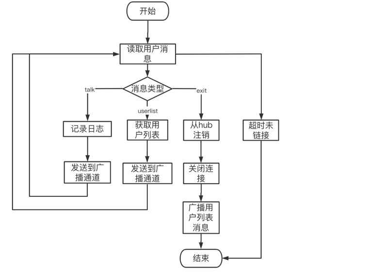

#### 1、整体框架

服务端 :基于Gorilla/Websocket协议的在线聊天服务，通信协议使用Protobuf


#### 2、目录结构

```
..
├── README.md
├── __pycache__
│   └── locustfile.cpython-39.pyc
├── app
│   └── main.go
├── go.mod
├── go.sum
├── home.html
├── internal
│   ├── config
│   │   └── logConfig.go
│   ├── logInfo
│   │   └── sys.log
│   ├── model
│   │   ├── ChatProto.pb.go
│   │   └── ChatProto.proto
│   ├── msgType
│   │   └── MsgType.go
│   ├── service
│   │   └── serviceChat.go
│   └── wsClient
│       ├── connection.go
│       └── hub.go
├── test
│   ├── ChatProto_pb2.py
│   ├── __pycache__
│   │   ├── ChatProto_pb2.cpython-39.pyc
│   │   └── locustfile.cpython-39.pyc
│   ├── locustFile.py
│   └── 压测报告.html
└── 流程图.png

```

#### 3. 代码逻辑分层


|层|文件夹|主要职责|调用关系|其他说明|
| ------------ | ------------ | ------------ | ------------ | ------------ |
|应用层 |app/main.go  |服务器启动 |调用service层   |不可同层调用
|service层  |internal/service | 处理来自对等方的 websocket 请求 | 调用websocket层 ，被应用层调用  |不可同层调用
|websocket层 |internal/wsClient|提供基础的websocket功能 | 调用model，被服务层调用    |不可同层调用
| model |internal/model  |定义数据类型 | 被websocket层测试层层调用   |不可同层调用
| 配置文件 |internal/log  |日志配置,系统日志文件 | 被websocket层 service层调用   |不可同层调用
|测试层 |test|进行压力测试 | 调用websocket层，model层    |不可同层调用

#### 4.存储设计

```
服务器：

type Client struct {
	Hub *Hub
	// websocket 连接器
	Conn *websocket.Conn
	//消息的缓冲通道。
	Send chan []byte
	ChatRequest *model.ChatRequest
}

//抽象连接器
type Hub struct {
	// 注册客户
	Clients map[*Client]bool
	// 来自客户端的发送消息
	Broadcast chan []byte
	// 注册来自客户端的请求
	Register chan *Client
	//取消注册来自客户端的请求。
	Unregister chan *Client
}

message ChatRequest {
    string userName = 1;
    string type = 2;
    string content = 3;
    map<string,string> userList = 4;
}
```


#### 5. 接口设计

服务端接口地址为：ws://127.0.0.1:9000/ws


#### 6. 第三方库

1. websocket框架
   代码 https://github.com/gorilla/websocket
   文档 https://pkg.go.dev/github.com/gorilla/websocket

2. 用于 数据传输
   代码 https://github.com/protocolbuffers/protobuf
   文档 https://developers.google.com/protocol-buffers/docs/gotutorial


#### 7. 如何编译执行

go run main.go

#### 8.todo

优化心跳连接部分，代码功能分层优化


#### 9.流程图



